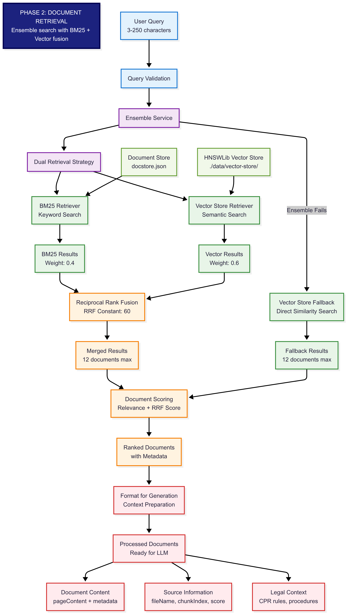
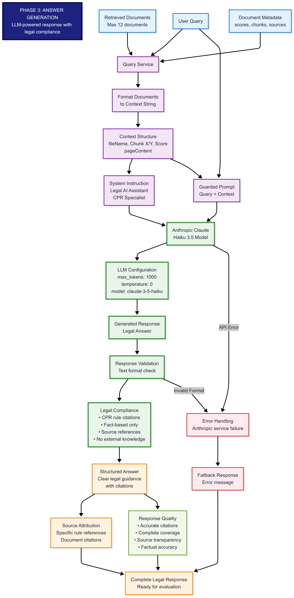
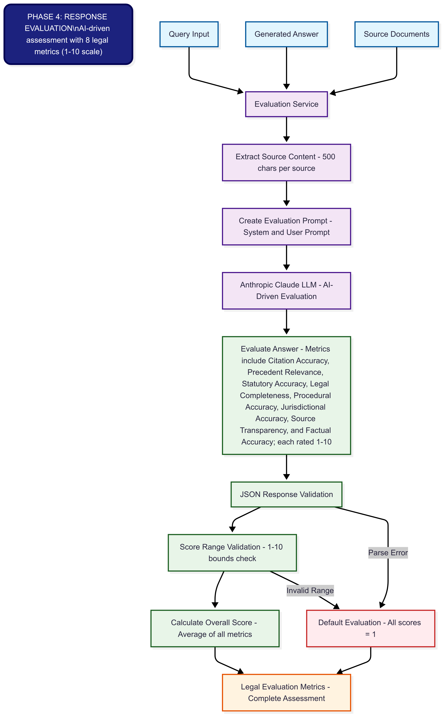

# RAG System Design for Civil Procedure Rules (CPR)

## System Overview

My designed Retrieval-Augmented Generation (RAG) system consists of four main components:

- **Ingestion**: Data preprocessing and storage.
- **Retrieval**: Query processing and document matching.
- **Generation**: Response creation using an LLM.
- **Evaluation**: Assessment of the system's performance.

Initially, I implemented an in-memory solution for rapid prototyping; however, I found this impractical because it required re-ingesting documents after each server restart. Therefore, I moved to a more robust, file-based memory solution using the HNSW (Hierarchical Navigable Small World graphs) library, ensuring persistent storage. My architecture is designed to transition seamlessly to a proper vector store solution as it moves toward production readiness.

## Detailed Implementation

### Ingestion Phase

In the ingestion phase, I prepared the provided Civil Procedure Rules (CPR) documents for effective retrieval:

#### Text Splitting and Chunking Specifications:

- I chose LangChain's `RecursiveCharacterTextSplitter` because it splits documents semantically, maintaining paragraph and sentence integrity, which is crucial for meaningful responses in legal contexts.

- I configured chunks to approximately 8,000 characters (~2,000 tokens), which fits comfortably within Anthropic Haiku's 200,000-token context window. This configuration provides comprehensive context without exceeding practical token limits (~108,000 tokens per interaction).

#### Vector Embedding:

- For generating embeddings, I utilised Hugging Face's embedding API due to its reliable performance and free availability.

- Generated embeddings are persistently stored using the HNSWLib library.

- These embeddings are saved to a dedicated folder to ensure persistent, file-based storage.

### Retrieval Phase

My retrieval mechanism includes a dual-flow approach:

#### Ensemble Flow (primary):

- This method combines BM25 keyword search with semantic vector store search.

- I applied Reciprocal Rank Fusion (RRF) to effectively merge results, significantly improving accuracy compared to using a single retrieval method.

- I also incorporated adjustable weights between BM25 and vector results based on empirical testing.

#### Vector Store Flow (fallback):

- This simpler alternative employs direct embedding similarity matches.

- I kept this method available as commented-out fallback code, its also being used in an event the Ensemble approach fails.

#### Query Validation:

- Queries are limited to 3-250 characters to ensure they are concise and meaningful.

#### Document Processing:

- I limited retrieval to a maximum of 12 ranked documents per query.

- Retrieved documents are formatted into a unified structure for easy integration into the generation phase.

### Generation Phase

In this phase, I create a comprehensive context using retrieved documents, user queries, and guided prompts.

I chose Anthropic's Haiku model 3.5 for fast responses primarily. I also experimented with the newer models and got much better responses.

### Evaluation Phase

To reliably measure system accuracy and performance, I implemented an AI-driven evaluation service:

- This service resubmits the generated response along with the original query and relevant source content back to the LLM for self-evaluation.

- Responses are assessed using several metrics, including:

  - **Citation Criteria**: Accuracy in citing specific rules and sources.
  - **Precedent Relevance**: Effectiveness in using legal precedents from the provided sources.
  - **Statutory Accuracy**: Precision in quoting and interpreting statutory provisions.

This AI-driven evaluation approach provides objective, consistent, and insightful performance feedback.

## Architectural Decisions & Justifications

I initially chose a file-based storage solution because it has less overhead and is quicker to implement, making it suitable for rapid prototyping. The HNSWLib was specifically selected for its efficiency in providing persistent storage, ensuring embeddings are retained between restarts without significant operational complexity or additional costs.

I also chose LangChain's `RecursiveCharacterTextSplitter` for its ability to preserve semantic integrity, which is essential for coherent and contextually accurate legal responses. Typically, the splitting process is conducted first, followed by the generation of embeddings. These embeddings are then persistently stored in a file-based vector store, ensuring that the resulting responses maintain clarity, coherence, and relevance.

I adopted an ensemble retrieval approach with Reciprocal Rank Fusion (RRF) based on its demonstrated ability to enhance accuracy by merging keyword-based and semantic retrieval methods. Empirical tests confirmed that the ensemble approach consistently outperformed individual retrieval methods.

For the generation phase, I primarily selected Anthropic's Haiku model 3.5 due to its ability to produce fast responses. Additionally, I experimented with newer models, which consistently yielded significantly improved response quality, thanks to their enhanced capabilities and larger context windows; however, these models are more expensive to use. 

Finally, I implemented an AI-driven evaluation method to provide an objective and scalable approach to assess the system's performance across multiple metrics, ensuring rigorous and continuous validation.

## Demonstration and Evaluation

My RAG system effectively answers queries regarding the Civil Procedure Rules (CPR), providing accurate, citation-backed responses. The ensemble retrieval approach enhances accuracy, while the AI-driven evaluation ensures reliability, making my system robust, scalable, and demonstrably effective.

Overall, this system effectively meets the Garfield AI Technical Challenge requirements by combining thoughtful architectural design decisions with a rigorous evaluation methodology.

### System Flow Diagrams

The following diagrams illustrate the complete system flow across all four phases:

*Phase 1: Document ingestion and vector storage process*

*Phase 2: Ensemble search and document retrieval process*

*Phase 3: LLM response generation with context*

*Phase 4: AI-driven evaluation and scoring process*