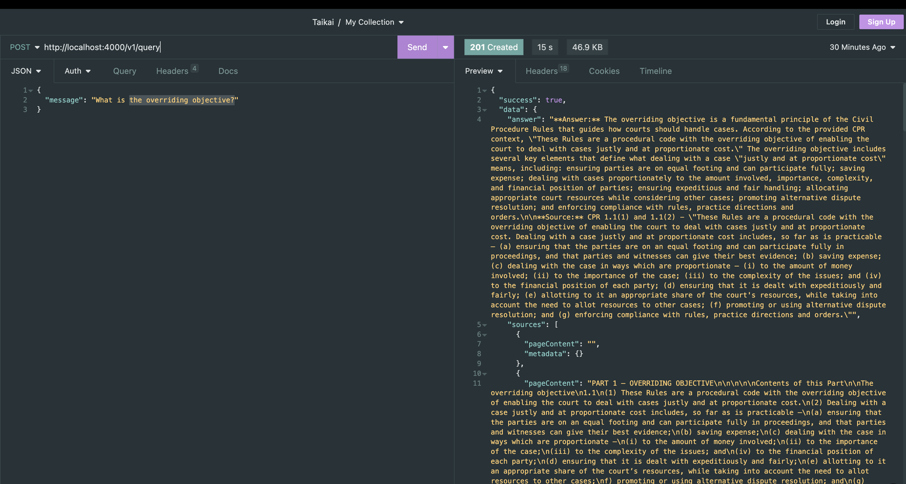
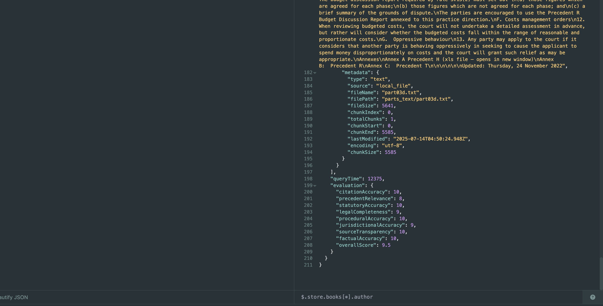

# Legal Document Query System

A NestJS-based legal document query system that uses semantic vector search and ensemble search (BM25 + vector fusion) to provide accurate answers with proper source citations.

## Documentation

For detailed system architecture and implementation details, see [System Explanation](Exlanation.md).

## Test Screenshots

The system in action:


*Example query and response with evaluation*


*System performance and accuracy metrics*

## Technologies Used

- **Backend Framework**: NestJS
- **Language**: TypeScript
- **Vector Database**: HNSWLib (via LangChain)
- **Search**: Ensemble search combining BM25 and vector similarity
- **LLM**: Anthropic Claude
- **Embeddings**: Hugging Face sentence-transformers
- **Document Processing**: LangChain document loaders and text splitters
- **API Documentation**: Swagger/OpenAPI
- **Testing**: Jest

## How to Run

### Prerequisites
- Node.js (v18 or higher)
- npm or yarn
- Anthropic API key

### Installation

1. Install dependencies:
```bash
npm install
```

2. Set up environment variables:
```bash
ANTHROPIC_API_KEY=your_anthropic_api_key_here
```

3. Place your legal document text files in the `parts_text/` directory

### Running the Application

**Development mode:**
```bash
npm run start:dev
```

**Production mode:**
```bash
npm run build
npm run start:prod
```

**Test mode:**
```bash
npm test
```

### API Documentation
Available at `http://localhost:4000/docs` when the server is running

### Environment Variables
- `PORT` - Server port (defaults to 4000)
- `NODE_ENV` - Environment mode (development/production)
- `ANTHROPIC_API_KEY` - Anthropic API key for Claude access

